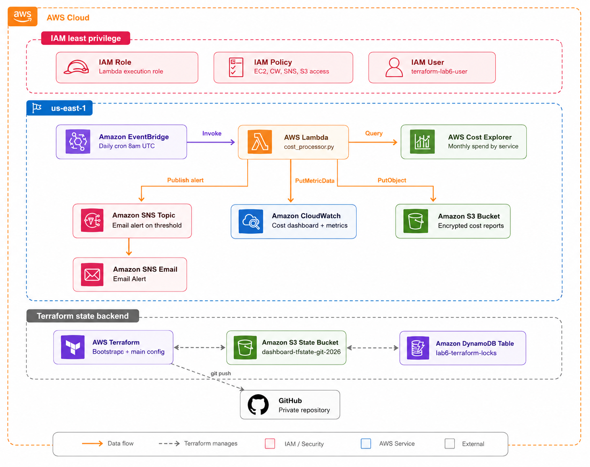

# AWS Cost Dashboard

## Overview
This project deploys an automated AWS cost monitoring dashboard using:
- AWS Lambda (cost data processor)
- AWS Cost Explorer (cost data source)
- Amazon CloudWatch (dashboard and metrics)
- Amazon SNS (email alerts)
- Amazon S3 (cost report storage)

## Prerequisites
- Terraform >= 1.5.0
- AWS CLI configured with profile `lab6`
- Python 3.11

## Deployment
See deployment instructions. Never commit terraform.tfvars to version control.

## Architecture
EventBridge (daily schedule) triggers Lambda, which queries Cost Explorer,
publishes metrics to CloudWatch, stores reports in S3, and sends SNS alerts
when costs exceed the configured threshold.

## Architecture

### Components
- **EventBridge** - Triggers Lambda daily at 8am UTC
- **Lambda** - Processes cost data from Cost Explorer
- **Cost Explorer** - Source of monthly AWS spend data
- **CloudWatch** - Hosts the cost dashboard and custom metrics
- **SNS** - Sends email alerts when costs exceed $100
- **S3** - Stores cost reports with encryption and versioning
- **DynamoDB** - Manages Terraform state locking
- **IAM** - Least privilege roles and policies
